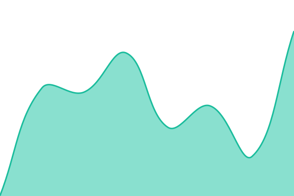
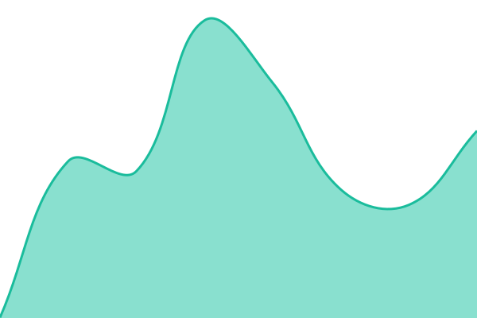
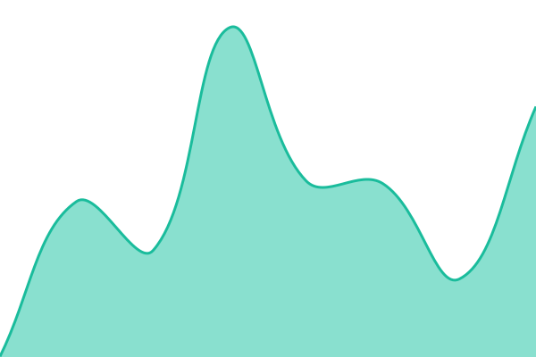
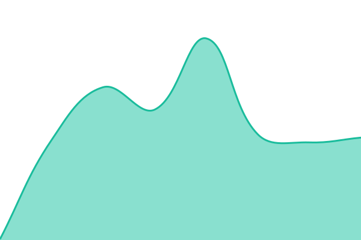
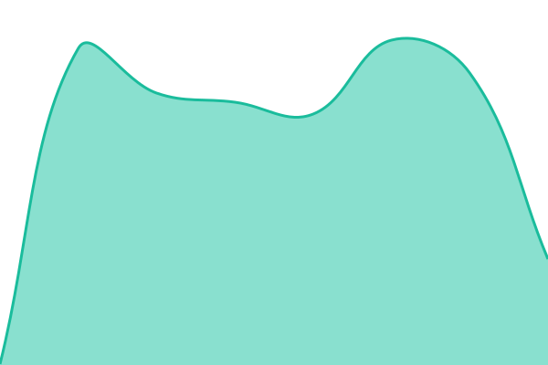

# [📈 Live Status](https://status.hellodynamicbiz.com): <!--live status--> **🟧 Partial outage**

<!--start: status pages-->
<!-- This summary is generated by Upptime (https://github.com/upptime/upptime) -->
<!-- Do not edit this manually, your changes will be overwritten -->
<!-- prettier-ignore -->
| URL | Status | History | Response Time | Uptime |
| --- | ------ | ------- | ------------- | ------ |
|  [Trees Cafe](https://treescafekandy.com) | 🟩 Up | [trees-cafe.yml](https://github.com/ncode-git/uptime/commits/HEAD/history/trees-cafe.yml) | 

 256ms
     
 | 

<a href="https://status.hellodynamicbiz.com/history/trees-cafe">100.00%</a>
    

|  [Royal Bar & Hotel](https://royalbarandhotel.com) | 🟩 Up | [royal-bar-and-hotel.yml](https://github.com/ncode-git/uptime/commits/HEAD/history/royal-bar-and-hotel.yml) | 

 251ms
     
 | 

<a href="https://status.hellodynamicbiz.com/history/royal-bar-and-hotel">100.00%</a>
    

|  [Island Canvas](https://island-canvas.com) | 🟥 Down | [island-canvas.yml](https://github.com/ncode-git/uptime/commits/HEAD/history/island-canvas.yml) | 

 0ms
     
 | 

<a href="https://status.hellodynamicbiz.com/history/island-canvas">0.00%</a>
    

|  [Goldan Paints](https://www.goldenpaints.lk) | 🟩 Up | [goldan-paints.yml](https://github.com/ncode-git/uptime/commits/HEAD/history/goldan-paints.yml) | 

 2137ms
     
 | 

<a href="https://status.hellodynamicbiz.com/history/goldan-paints">100.00%</a>
    

|  [eMatrix](https://ematrixit.com/) | 🟥 Down | [e-matrix.yml](https://github.com/ncode-git/uptime/commits/HEAD/history/e-matrix.yml) | 

 0ms
     
 | 

<a href="https://status.hellodynamicbiz.com/history/e-matrix">0.00%</a>
    

|  [MAD Monkey](https://madmonkeystudio.com.au/) | 🟥 Down | [mad-monkey.yml](https://github.com/ncode-git/uptime/commits/HEAD/history/mad-monkey.yml) | 

 0ms
     
 | 

<a href="https://status.hellodynamicbiz.com/history/mad-monkey">0.00%</a>
    

|  [King Kandy](https://kingskandy.lk/) | 🟥 Down | [king-kandy.yml](https://github.com/ncode-git/uptime/commits/HEAD/history/king-kandy.yml) | 

 180ms
     
 | 

<a href="https://status.hellodynamicbiz.com/history/king-kandy">0.00%</a>
    

|  [Cyberflake](https://cyberflake.biz/) | 🟩 Up | [cyberflake.yml](https://github.com/ncode-git/uptime/commits/HEAD/history/cyberflake.yml) | 

 239ms
     
 | 

<a href="https://status.hellodynamicbiz.com/history/cyberflake">100.00%</a>
    

<!--end: status pages-->

[**Check Status**](https://status.hellodynamicbiz.com)

## 📄 License

- Powered by: [Upptime](https://github.com/upptime/upptime)
- Code: [MIT](./LICENSE) © [Anand Chowdhary](https://anandchowdhary.com), supported by [Pabio](https://pabio.com)
- Data in the `./history` directory: [Open Database License](https://opendatacommons.org/licenses/odbl/1-0/)
